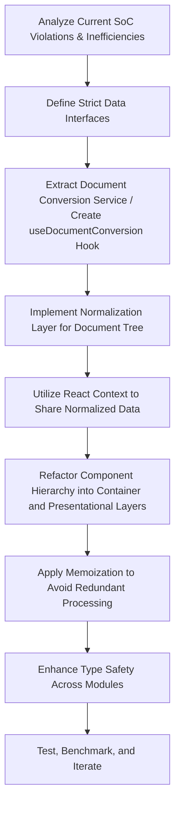

# Unified Improvement Plan for Lark2React

This document consolidates the previous separate plans into a single unified plan, addressing both general code improvements and specific inefficiencies in handling the Document Tree extracted from Lark.

---

## 1. General Code Improvement

### 1.1 Violations of Separation of Concerns (SoC)

- **Issue: Conversion Logic in UI Components**  
  In components like `Converter.tsx`, document traversal and conversion logic (e.g., computing hash values and calling `id2Component`) are embedded directly into the render function, intertwining business logic with presentation.
- **Proposed Remedy:**
  - Extract the document conversion into a dedicated service or a custom hook (e.g., `useDocumentConversion`).
  - The UI component should simply consume the processed data.

### 1.2 Poor Modularity and High Coupling

- **Issue: Overcoupled Components**  
  UI components mix data transformation logic with rendering, making changes in data processing impact multiple locations.
- **Proposed Remedy:**
  - Decompose components into container (logic) and presentational (UI) layers.
  - Introduce a separate data transformation layer to normalize and convert document blocks before rendering.

### 1.3 Inefficient Processing

- **Issue: Redundant Recalculation**  
  The document conversion process recalculates hash values and processes data on each render, without caching.
- **Proposed Remedy:**
  - Use memoization (via `React.useMemo`) within conversion hooks to cache computed results and reduce redundant processing.

### 1.4 Type Safety Improvements

- **Issue: Overuse of `any` Types**  
  Certain areas in the codebase use `any` instead of well-defined TypeScript interfaces.
- **Proposed Remedy:**
  - Define strict interfaces for document blocks and conversion outputs to improve maintainability and reduce runtime errors.

---

## 2. Document Tree Traversal and Processing Improvements

### 2.1 Current Issues in Document Tree Handling

- **Inefficient Subtree Handling:**  
  The current implementation in functions like `groupingblockData` uses imperative loops to process and group children arrays, resulting in redundant iterations and complex code.
- **Tight Coupling Between Traversal and Rendering:**  
  Functions such as `id2Component` are responsible for both grouping and rendering, mixing the traversal logic with UI concerns.
- **Lack of Normalization:**  
  The raw document tree is processed on every render without establishing an intermediate, normalized structure, leading to performance bottlenecks.

### 2.2 Proposed Architectural Improvements

- **Normalization Layer:**  
  Create a normalization module (e.g., `documentNormalization.ts`) that transforms the raw document tree into a normalized structure (such as a flat map or a clearly defined tree of parent-child relations).  
  _Benefit:_ Enables efficient lookups and reduces duplicate processing.

- **Custom Hook for Document Conversion:**  
  Develop a custom hook, `useDocumentConversion`, that:
  - Takes the normalized data and applies the conversion logic.
  - Utilizes memoization (`React.useMemo`) to cache conversion results.
  - Separates business logic from UI rendering.
- **React Context for Shared State:**  
  Store the normalized document tree within a React Context so that multiple components can consume the data without reprocessing, ensuring a single source of truth.
- **Functional Programming Approaches:**  
  Refactor grouping logic (currently in `groupingblockData`) using functional programming methods (e.g., using `Array.reduce`) for clearer and more efficient code.

---

## 3. Unified Roadmap and Next Steps

### Next Steps

1. **High Priority:**

   - Extract and refactor the document conversion logic from UI components.
   - Develop and integrate `useDocumentConversion` with memoization.

2. **Medium Priority:**

   - Build a normalization layer for the document tree.
   - Utilize React Context for efficient data sharing.

3. **Low Priority:**

   - Refine type definitions and refactor code to replace `any` types.
   - Refactor remaining components into container/presentational patterns.

4. **Testing and Benchmarking:**
   - Develop unit tests for the conversion logic and normalization functions.
   - Benchmark performance before and after refactoring.

---

## 4. Expected Benefits

- **Maintainability:** Clear separation of concerns and modular design leads to easier maintenance and updates.
- **Performance:** Reduced redundant processing through memoization and use of a normalization layer will improve responsiveness, especially for large document trees.
- **Scalability:** A modular architecture allows for scalable enhancements and easier integration of new features.
- **Robustness:** Strong type safety and isolated business logic reduce runtime errors and facilitate safer refactoring.

---

This unified plan merges our previous improvement strategies into one actionable roadmap, addressing both general code quality and specific inefficiencies in document tree processing.
